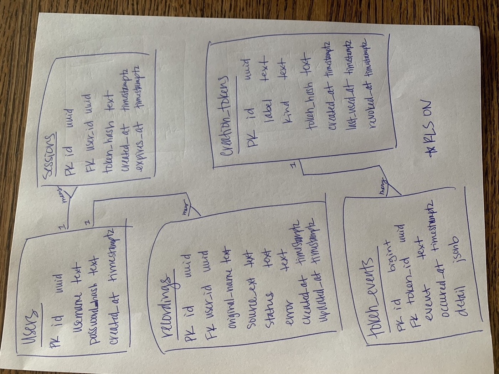
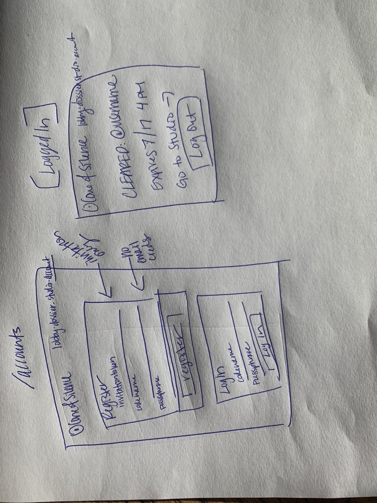
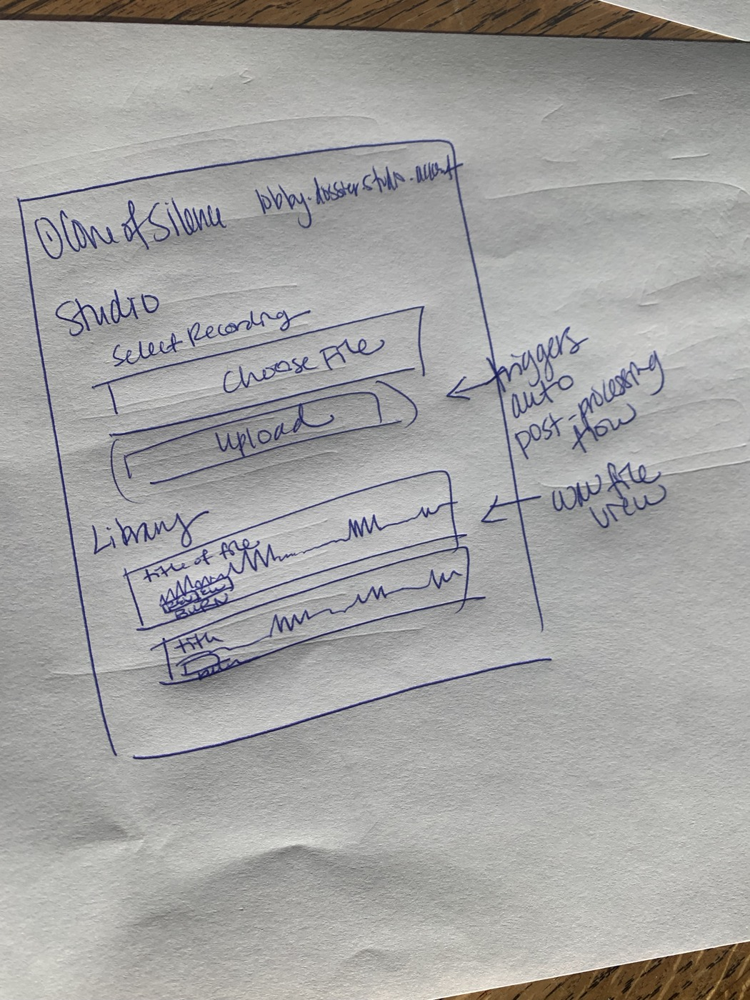

# 🕵️ Cone of Silence

An invite-only recording studio and call lobby, styled like a 1960s spy
dossier. Invited users get a zero-PII account, a WebRTC call room, and a
**Studio** that enhances podcast recordings with a real ffmpeg chain
(denoise → de-ess → compress → EQ → loudness) on a server I run.

**Live:** https://coneofsilence.app · **Stack:** Next.js + Tailwind (Vercel),
Express + WebSockets + ffmpeg (DigitalOcean), Supabase Postgres.

## Pages

| Route | Page |
| --- | --- |
| `/` | Lobby — invite-token check gates room creation |
| `/room` | Two-person WebRTC call |
| `/account` | Invite-only register / login (codename + passphrase only) |
| `/studio` | Upload → watch it process → listen, download, or burn |
| `/admin` | Operator console: mint / relabel / revoke / purge invite tokens |
| `/brainstorm` | The original feature-plan dossier |

## Server API (`server/`)

| Endpoints | Purpose |
| --- | --- |
| `POST /tokens/verify` | Lobby token check |
| `POST /auth/signup·login·logout`, `GET /auth/me` | Accounts + bearer sessions |
| `POST·GET·DELETE /studio/recordings[/:id]` + artifact routes | Upload / list / fetch / burn recordings |
| `GET·POST·PATCH·DELETE /admin/tokens[/:id]` | Full token CRUD (operator secret) |
| `WS /ws` | Call signaling |

Everything is validated before touching the database and fails **closed**
(store down ⇒ 503, never a silent grant). Constant-time login, lockouts on
repeated failures, 1 GiB/file + 2 GiB/user upload caps, owner-scoped 404s.
130 vitest tests cover happy and sad paths.

## Schema



`users 1—N sessions`, `users 1—N recordings`, `creation_tokens 1—N
token_events`. Migrations in `supabase/migrations/`; RLS on with zero
policies, so only the server's service-role key can read anything.

## Wireframes




## Privacy & limitations

- No PII: an account is a codename + bcrypt hash. Tokens stored as hashes.
- Uploads live on hardware I control; the raw file is deleted once the
  enhanced version exists; burning removes everything.
- Calls are STUN-only for now: strict/symmetric NAT (e.g. phone on
  cellular) can fail to connect until TURN lands in the final project.

## Run locally

```bash
cd server && cp env.example .env && npm i && npm run dev   # API :8787
npm i && npm run dev                                       # frontend :3000
```

Studio processing needs `ffmpeg` (with `arnndn`) plus `RNNOISE_MODEL` and
`UPLOAD_DIR` in `server/.env`. Fresh database: `supabase db push`.
