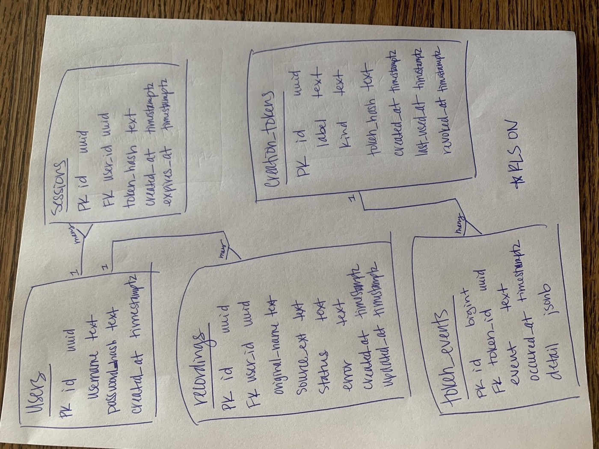
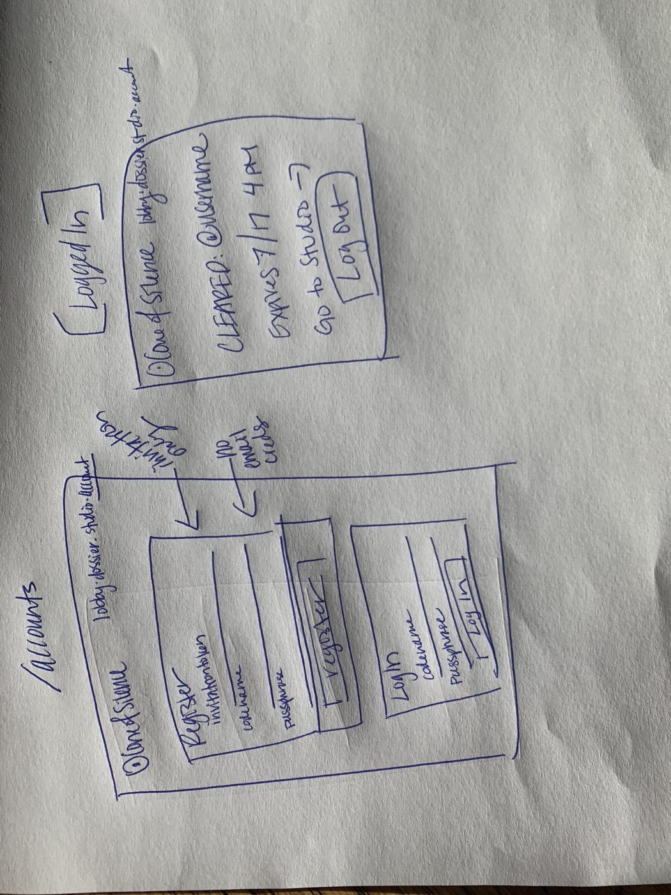
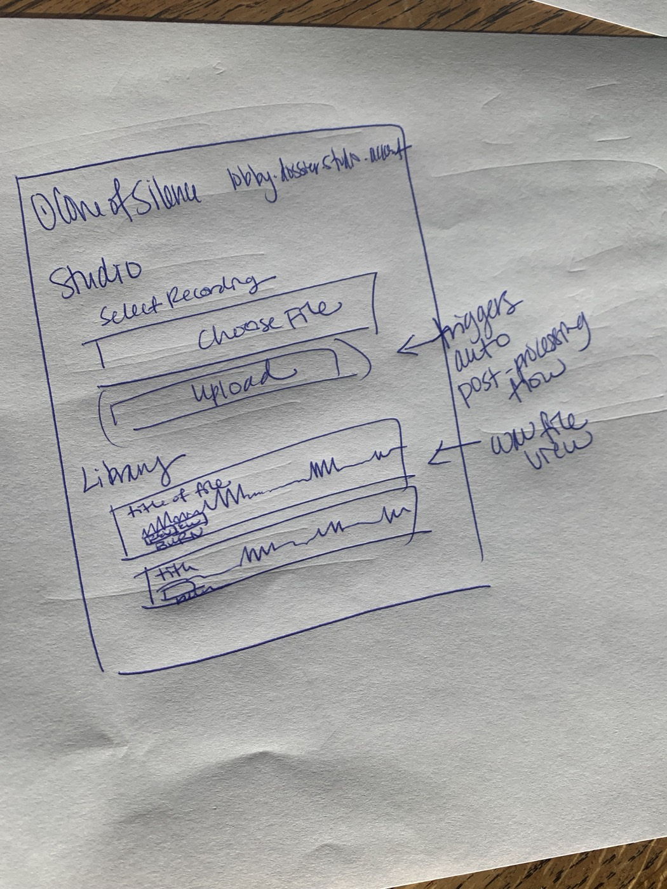

# 🕵️ Cone of Silence

An invite-only recording studio and call lobby, styled like a 1960s spy
dossier. Invited users get a zero-PII account, an end-to-end encrypted
WebRTC call room, a podcast mode where each host records locally and a
real ffmpeg darkroom develops the episode, and a **Studio** that enhances
uploaded recordings (denoise → de-ess → compress → EQ → loudness) on a
server I run.

A session runs end to end without the server ever seeing content. An invite
token gets you an account and a room; the room's encryption secret rides the
URL fragment, so signaling and the TURN relay carry ciphertext only. In podcast
mode each host records their own camera and mic locally at full quality and
then ships the take over the call's data channel — the call is the sync signal,
never the recording. Finished audio goes to the Studio, where a real ffmpeg
chain denoises, de-esses, compresses, EQs, and normalizes it on hardware I
control, so every listener gets the same result regardless of their browser.

**Live:** https://www.coneofsilence.app · **Stack:** Next.js + Tailwind (Vercel),
Express + WebSockets + ffmpeg (DigitalOcean), Supabase Postgres.

## Why this stack

- **Next.js + Tailwind, deployed on Vercel** — Tailwind v4's CSS-first tokens
  drive the whole dossier look (and both color schemes) from one file.
- **Express + WebSockets + ffmpeg on a DigitalOcean droplet** — call signaling
  needs a long-lived socket and audio enhancement needs real ffmpeg; neither
  fits serverless.
- **Supabase Postgres** — managed SQL with migrations, locked down so only the
  server's service-role key can read anything.

## Packages

The frontend runs on Next, React, and Tailwind alone. Three npm packages do the
load-bearing work on the server (`server/package.json`):

- **[`ws`](https://github.com/websockets/ws)** — the signaling socket. Setting
  up a call means trading SDP offers and ICE candidates over a long-lived
  bidirectional channel, which is what `WS /ws` below is.
- **[`multer`](https://github.com/expressjs/multer)** — multipart upload
  parsing for Studio. The 1 GiB/file cap is enforced at the parser, so an
  oversized upload is rejected mid-stream instead of after it lands on disk.
- **[`bcryptjs`](https://github.com/dcodeIO/bcrypt.js)** — passphrase hashing.
  An account is a codename and a bcrypt hash, which is the whole reason the
  database holds no PII.

## Pages

| Route | Page |
| --- | --- |
| `/` | Lobby — invite-token check gates room creation |
| `/room` | E2EE WebRTC call (up to four) · podcast recording mode |
| `/account` | Invite-only register / login (codename + passphrase only) |
| `/studio` | Upload → watch it process → listen, download, or burn |
| `/admin` | Operator console: mint / relabel / revoke / purge invite tokens |

## Server API (`server/`)

| Endpoints | Purpose |
| --- | --- |
| `POST /tokens/verify` | Lobby token check |
| `POST /auth/signup·login·logout`, `GET /auth/me` | Accounts + bearer sessions |
| `POST·GET·DELETE /studio/recordings[/:id]` + artifact routes | Upload / list / fetch / burn recordings |
| `GET·POST·PATCH·DELETE /admin/tokens[/:id]` | Full token CRUD (operator secret) |
| `WS /ws` | Call signaling |

Everything is validated before touching the database and fails **closed**
(store down ⇒ 503, never a silent grant). Constant-time login, lockouts on
repeated failures, 1 GiB/file + 2 GiB/user upload caps, owner-scoped 404s.
171 vitest tests cover happy and sad paths.

## Schema



`users 1—N sessions`, `users 1—N recordings`, `creation_tokens 1—N
token_events`. Migrations in `supabase/migrations/`; RLS on with zero
policies, so only the server's service-role key can read anything.

## Wireframes




## Privacy & limitations

- No PII: an account is a codename + bcrypt hash. Tokens stored as hashes.
- Uploads live on hardware I control; the raw file is deleted once the
  enhanced version exists; burning removes everything.
- Calls try a direct P2P path first and fall back to a TURN relay on
  hostile networks (e.g. cellular). Up to four participants.

## Design decisions

- **End-to-end encrypted.** The room secret rides the URL fragment and never
  reaches the server; frames are encrypted client-side, so signaling and TURN
  carry ciphertext only ([threat model](docs/security-model.md)).
- **Fail closed.** Every endpoint validates before touching the database;
  store down means 503, never a silent grant.
- **Theme follows the OS, until you say otherwise.** One set of semantic CSS
  variables flips light and dark, and a DAY / NIGHT toggle in the nav overrides
  the OS in either direction. The choice is a `data-theme` attribute on `<html>`
  restored before first paint; no component ever branches on theme.
- **Enhancement is server-side.** The ffmpeg chain runs on hardware I control
  so every listener gets the same result, regardless of their browser.
- **The room grid is a deliberate no-scroll 2×2.** Every face stays visible on
  a phone at once, tiles sized in `dvh` — chosen over a stacked scrolling
  mobile layout. An intentional constraint the layout is built around, not a
  missing breakpoint.

## Hardest parts

- **Four-way WebRTC.** Mesh negotiation, ICE restarts after network flips,
  and proving relay fallback on real cellular — debugged live on the droplet.
- **The synced podcast take.** Each browser records locally, then swaps
  tracks over the call's data channel into OPFS; making that survive a
  mid-take refresh took several drill-and-fix rounds.
- **Audio truth-finding.** Chasing an echo report through mute paths and
  transmit audits before it could be pinned as a playback loop, not a leak.

## Run locally

**Required to start:** Node 22, and a Supabase project. The server exits on
boot without `SUPABASE_URL` and `SUPABASE_SERVICE_ROLE_KEY`, or without a
16-char `ADMIN_SECRET` — [`server/env.example`](server/env.example) carries the
one-liner that generates one. A fresh database is `supabase db push`.

**Only for Studio's enhancement pass:** [ffmpeg](https://ffmpeg.org) built with
the `arnndn` filter, plus its RNNoise model, and `RNNOISE_MODEL` + `UPLOAD_DIR`
in `server/.env`. Everything else — lobby, calls, accounts, podcast mode — runs
without ffmpeg; an upload just settles into its `FAILED` state.

Copy the env examples and fill them in: [`env.example`](env.example)
(frontend) and [`server/env.example`](server/env.example) (server).

```bash
# terminal 1 — server (repo root)
cd server && cp env.example .env && npm i && npm run dev   # API + ws :8787

# terminal 2 — web (repo root)
npm i && npm run dev                                       # frontend :3000
```

Darkroom (episode post): the podcast Mac needs node, ffmpeg with arnndn, and the rnnoise model at server/models/std.rnnn — `npm run darkroom -- --vault <Tape Vault>`.

## Tests

```bash
npm test                       # root: vitest (frontend units + darkroom)
npm --prefix server test       # server: vitest (API, stores, ws, studio)
npm run test:all               # both, one command
```

`e2e/*.js` are manual, macOS-bound headless-Chrome scripts (real WebRTC
calls, real ffmpeg) — not part of any automated suite; each file's header
comment has its run instructions.

## Docs

- [`docs/security-model.md`](docs/security-model.md) — threat model and
  fail-closed guarantees
- [`docs/drills/`](docs/drills) — live-call and podcast-take drill reports
- [`deploy/RUNBOOK.md`](deploy/RUNBOOK.md) — droplet deploy and operations
